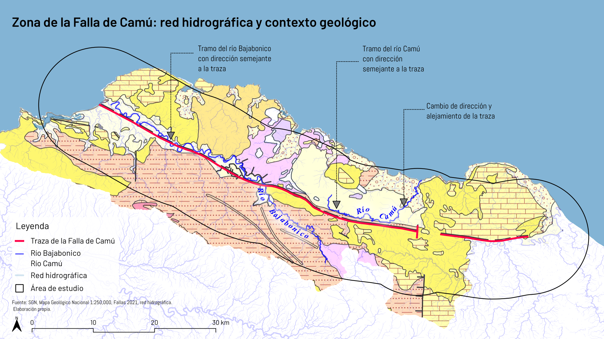

```{r setup, include=FALSE}
knitr::opts_chunk$set(
  echo = FALSE,
  message = FALSE,
  warning = FALSE,
  comment = "#>",
  fig.width = 7,
  fig.height = 5,
  out.width = "100%"
)

pkg_needed <- c("sf", "terra", "ggplot2", "dplyr", "here", "elevatr", "knitr")
has_pkg <- sapply(pkg_needed, requireNamespace, quietly = TRUE)
if (!all(has_pkg)) {
  message("Paquetes ausentes: ", paste(names(has_pkg)[!has_pkg], collapse = ", "))
}
invisible(sapply(names(has_pkg)[has_pkg], library, character.only = TRUE))
```

## Resumen

Este estudio evalúa en qué medida el relieve y el drenaje de la zona de la Falla de Camú, en el norte de la República Dominicana, presentan patrones compatibles con un posible control estructural. Se utilizaron la traza cartográfica de la falla, un modelo digital de elevación, una red hidrográfica derivada de ALOS-PALSAR, la hidrografía nominal de los ríos Camú y Bajabonico y cartografía geológica del Servicio Geológico Nacional. El análisis se realizó dentro de un ámbito de hasta 10 km a cada lado de la traza.

Se calculó la orientación general de la traza y se comparó con la orientación de los segmentos de los ríos y de las laderas de mayor pendiente. También se evaluó cómo cambia esta correspondencia en las franjas de 0–1 km, 1–3 km y 3–10 km. La orientación general de la traza fue de aproximadamente 109.9°. En el río Camú y en las laderas de mayor pendiente, la correspondencia direccional fue mayor cerca de la traza y disminuyó con la distancia. En el río Bajabonico, en cambio, los valores se mantuvieron relativamente estables entre las franjas analizadas.

Los resultados muestran que existen relaciones espaciales y direccionales compatibles con un posible control estructural, aunque estas no se manifiestan de manera uniforme en todo el ámbito de estudio. La cartografía geológica también muestra que la traza y los cauces atraviesan diferentes unidades geológicas, por lo que la interpretación debe considerar otros factores, como la litología y los procesos erosivos. Las asociaciones identificadas no permiten, por sí solas, establecer actividad tectónica reciente.

**Palabras clave:** geomorfología estructural; Falla de Camú; drenaje; relieve; orientación; República Dominicana.

# 1. Introducción

## 1.1. Contexto y problema geomorfológico

La zona de la Falla de Camú se localiza en el norte de la República Dominicana y presenta contrastes de elevación, laderas con diferentes pendientes y una red de drenaje formada por numerosos cauces. Dentro de este ámbito, los ríos Camú y Bajabonico son los principales cauces considerados en el análisis.

Desde la geomorfología estructural, una falla puede influir en la organización del relieve y del drenaje, por ejemplo mediante cambios de pendiente, alineamientos o tramos de cauces con direcciones semejantes a la estructura. Sin embargo, estas relaciones también pueden estar condicionadas por la litología y por los procesos erosivos [@pedraza1996; @gutierrez2008].

En este trabajo se evalúa si algunas características del relieve y del drenaje de la zona de la Falla de Camú presentan patrones espaciales y direccionales compatibles con un posible control estructural.

## 1.2. Justificación

Analizar la relación entre una falla, el relieve y el drenaje permite evaluar si determinadas formas del terreno y algunos tramos de los cauces presentan una organización compatible con la estructura geológica. Sin embargo, la proximidad a una falla o una orientación semejante no son suficientes, por sí solas, para demostrar un control estructural.

Por esta razón, en este estudio se compara la orientación general de la traza de la Falla de Camú con la orientación de las laderas de mayor pendiente y de los ríos Camú y Bajabonico. También se evalúa cómo cambia esta correspondencia con la distancia a la traza y se utiliza la cartografía geológica como apoyo para la interpretación. Este enfoque permite reconocer posibles relaciones estructurales sin asumir que toda la configuración del relieve y del drenaje se debe a la falla [@anderson2010; @burbank2012].

## 1.3. Preguntas de investigación

**Pregunta principal**

¿En qué medida el relieve y el drenaje de la zona de la Falla de Camú presentan patrones compatibles con un posible control estructural?

**Preguntas específicas**

a. ¿Existe correspondencia entre la orientación general de la traza de la Falla de Camú y la orientación de las laderas de mayor pendiente, y cómo cambia esta relación con la distancia a la traza?

b. ¿En qué medida la orientación de los ríos Camú y Bajabonico coincide con la orientación general de la traza de la Falla de Camú, y cómo cambia esta relación con la distancia a la traza?


# 2. Marco teórico

## 2.1. Geomorfología estructural

La geomorfología estructural estudia cómo las estructuras geológicas, como fallas, pliegues y fracturas, pueden influir en la forma y organización del relieve. Esta influencia puede observarse en la disposición de laderas, valles, alineamientos y redes de drenaje. Sin embargo, la configuración del paisaje también depende de otros factores, como la litología y los procesos erosivos [@pedraza1996; @gutierrez2008].

La geomorfología tectónica está relacionada con este enfoque, pero se interesa especialmente por la respuesta del paisaje a la deformación de la corteza y por las evidencias que permiten estudiar actividad tectónica y deformación reciente [@burbank2012]. En este trabajo se adopta principalmente un enfoque de geomorfología estructural, ya que se evalúa la relación entre la traza de la Falla de Camú, el relieve y el drenaje, sin medir directamente desplazamientos recientes ni tasas de deformación.

## 2.2. Relación entre fallas y formas del relieve

Las fallas pueden influir en la organización del relieve y estar asociadas con cambios de pendiente, alineamientos topográficos, escarpes, valles lineales y contrastes entre sectores elevados y deprimidos. Estas formas pueden conservar información sobre la estructura geológica, aunque también pueden ser modificadas por la erosión y por las características de las rocas [@anderson2010; @burbank2012].

En este estudio no se identificaron ni midieron de manera independiente escarpes o desplazamientos del terreno. El análisis del relieve se concentró en las laderas de mayor pendiente y en la comparación de su orientación con la orientación de la traza de la Falla de Camú.

## 2.3. Control estructural del drenaje

La organización de una red de drenaje puede estar influida por estructuras geológicas. Los cauces pueden seguir zonas de debilidad asociadas con fallas o fracturas, presentar tramos relativamente rectilíneos, cambios de dirección o direcciones semejantes a las de las estructuras presentes en el terreno [@pedraza1996; @gutierrez2008; @anderson2010].

Sin embargo, la dirección de los ríos no depende únicamente de las estructuras geológicas. También puede estar condicionada por la pendiente regional, la litología y la evolución erosiva del paisaje. Por esta razón, una coincidencia en orientación entre un cauce y una falla debe interpretarse como una posible evidencia de control estructural y no como una demostración directa de causalidad [@gutierrez2008].

## 2.4. Influencia de la litología en el relieve y el drenaje

La litología se refiere al tipo y a las características de las rocas que forman el terreno. Las diferencias en su resistencia frente a la meteorización y la erosión pueden influir en la pendiente de las laderas, la forma de los valles y la organización del drenaje [@pedraza1996; @gutierrez2008].

Por esta razón, una coincidencia entre la orientación de una falla, las laderas y los cauces no debe atribuirse únicamente a la estructura geológica. También es necesario considerar las unidades geológicas presentes en el área. En este trabajo, la cartografía geológica se utiliza de manera cualitativa para apoyar esta comparación y no para realizar un análisis cuantitativo de la resistencia de las rocas.

# 3. Materiales y métodos

## 3.1. Ámbito de estudio

El ámbito de estudio se localiza en el norte de la República Dominicana, en la zona de la Falla de Camú. Se extiende desde el valle del río Bajabonico y su salida hacia la bahía de La Isabela, al oeste, hasta el entorno de Sabaneta de Yásica, al este.

Para realizar el análisis se definió un ámbito de hasta 10 km de distancia a cada lado de la traza de la Falla de Camú utilizada como referencia. Esta delimitación permitió analizar, dentro de un mismo espacio, la orientación de la traza, las laderas de mayor pendiente y los ríos Camú y Bajabonico.

Los 10 km corresponden únicamente a una delimitación metodológica del estudio. No representan el ancho de la zona de falla ni un límite físico de su posible influencia sobre el relieve o el drenaje.

## 3.2. Datos y fuentes

La traza de trabajo de la Falla de Camú se obtuvo a partir de la capa *Fallas 2021* de ArcGIS Online (Item ID: 87841c12d9364c8184f0c73cb35b561e). Los segmentos correspondientes a la zona de estudio fueron seleccionados y unidos en QGIS. Esta traza se utilizó como referencia para calcular su orientación, medir distancias y comparar su relación con el relieve y el drenaje. Su ubicación también fue contrastada con la cartografía geológica y las memorias explicativas del Servicio Geológico Nacional (SGN).

Para representar el drenaje se utilizaron dos conjuntos de datos. El primero corresponde a una red hidrográfica derivada de un DEM ALOS-PALSAR mediante herramientas de GRASS GIS, utilizada para mostrar la organización general del drenaje. El segundo corresponde a una red hidrográfica nominal, utilizada para identificar y analizar específicamente los ríos Camú y Bajabonico.

El relieve se analizó mediante un modelo digital de elevación obtenido en R con el paquete `elevatr`. El raster utilizado presenta una resolución espacial aproximada de 71.7 m y fue trabajado en el sistema de coordenadas WGS 84 / UTM zona 19N (EPSG:32619). A partir de este modelo se representó la elevación y se calcularon la pendiente y la orientación del terreno.

La cartografía geológica del SGN se utilizó como apoyo para reconocer las principales unidades geológicas presentes en la zona de estudio y para interpretar si algunos patrones del relieve y del drenaje podían estar relacionados también con diferencias litológicas. Esta comparación fue de carácter cualitativo.

La Tabla \@ref(tab:datos-fuentes) resume los principales datos utilizados y su función dentro del análisis.

```{r datos-fuentes, echo=FALSE}
datos_fuentes <- data.frame(
  Dato = c(
    "Traza de la Falla de Camú",
    "Cartografía geológica",
    "Red hidrográfica",
    "Ríos Camú y Bajabonico",
    "Modelo digital de elevación"
  ),
  Fuente = c(
    "Fallas 2021, ArcGIS Online + contraste con SGN",
    "Servicio Geológico Nacional, escala 1:250,000 y hojas 1:50,000",
    "Red derivada de DEM ALOS-PALSAR mediante GRASS GIS",
    "Red hidrográfica nominal",
    "elevatr; resolución aproximada de 71.7 m"
  ),
  Uso_principal = c(
    "Orientación de referencia, medición de distancias y comparación con el relieve y el drenaje",
    "Contexto geológico y comparación cualitativa",
    "Representación general del drenaje",
    "Análisis de orientación de los cauces",
    "Elevación, pendiente y orientación del terreno"
  )
)

knitr::kable(
  datos_fuentes,
  format = "latex",
  booktabs = TRUE,
  caption = "Datos y fuentes utilizados en el análisis geomorfológico de la zona de la Falla de Camú.",
  col.names = c("Dato", "Fuente", "Uso principal")
) |>
  kableExtra::kable_styling(
    latex_options = "HOLD_position",
    position = "center"
  ) |>
  kableExtra::column_spec(1, width = "3.8cm") |>
  kableExtra::column_spec(2, width = "5.5cm") |>
  kableExtra::column_spec(3, width = "5.3cm") |>
  kableExtra::row_spec(
    1:nrow(datos_fuentes),
    extra_latex_after = "\\addlinespace[2pt]"
  )
```

## 3.3. Preparación de los datos

Las capas vectoriales utilizadas en el análisis fueron transformadas al sistema de coordenadas WGS 84 / UTM zona 19N (EPSG:32619), con unidades en metros. Esto permitió realizar de manera consistente los cálculos de distancia, longitud y orientación.

La traza de trabajo de la Falla de Camú fue previamente seleccionada a partir de la capa *Fallas 2021*. Debido a que estaba representada por varios segmentos, estos fueron revisados y unidos en QGIS. A partir de esta traza se definió un ámbito de estudio de hasta 10 km de distancia a cada lado.

La red hidrográfica general fue recortada a este ámbito. De manera independiente, se identificaron en la red hidrográfica nominal los ríos Camú y Bajabonico y se conservaron los tramos localizados dentro del mismo ámbito de estudio.

El modelo digital de elevación fue recortado y enmascarado utilizando el límite del ámbito de estudio. Para concentrar el análisis en la superficie terrestre, las elevaciones inferiores a 0 m fueron excluidas. A partir del DEM preparado se calcularon la pendiente y el aspecto del terreno mediante el paquete `terra` en R. Estos productos fueron utilizados posteriormente para identificar y analizar las laderas de mayor pendiente.

## 3.4. Análisis

El análisis se organizó en cuatro etapas. Primero se determinó la orientación de la traza de la Falla de Camú utilizada como referencia. Luego se comparó esta orientación con la de los ríos Camú y Bajabonico y con la orientación de las laderas de mayor pendiente. Finalmente, los resultados se observaron junto con la cartografía geológica disponible.

### 3.4.1. Orientación de la traza de la Falla de Camú

La traza de la Falla de Camú se descompuso en segmentos definidos entre vértices consecutivos. Para cada segmento se calculó su azimut a partir de sus coordenadas y posteriormente se transformó a una orientación entre 0° y 180°.

Se utilizó este rango porque el análisis considera el alineamiento de los segmentos y no su sentido de recorrido. De esta manera, dos direcciones opuestas que representan el mismo eje, por ejemplo 110° y 290°, se consideran equivalentes.

Para obtener una orientación general de la traza se calculó una media axial ponderada por la longitud de los segmentos. Esto significa que los segmentos de mayor longitud tuvieron mayor influencia en el resultado que los segmentos más cortos. La orientación general obtenida se utilizó como referencia para comparar posteriormente el drenaje y las laderas.

```{r funciones-orientacion}
calcular_orientacion <- function(objeto_sf, nombre) {

  lineas <- sf::st_cast(sf::st_geometry(objeto_sf), "LINESTRING")

  resultados <- lapply(seq_along(lineas), function(i) {
    coords <- sf::st_coordinates(lineas[i])
    if (nrow(coords) < 2) return(NULL)

    x1 <- coords[-nrow(coords), "X"]
    y1 <- coords[-nrow(coords), "Y"]
    x2 <- coords[-1, "X"]
    y2 <- coords[-1, "Y"]

    dx <- x2 - x1
    dy <- y2 - y1
    longitud_m <- sqrt(dx^2 + dy^2)
    azimut <- (atan2(dx, dy) * 180 / pi) %% 360
    orientacion <- azimut %% 180

    data.frame(
  parte = i,
  x1 = x1,
  y1 = y1,
  x2 = x2,
  y2 = y2,
  x_medio = (x1 + x2) / 2,
  y_medio = (y1 + y2) / 2,
  longitud_m = longitud_m,
  azimut = azimut,
  orientacion = orientacion,
  elemento = nombre
)
  })

  segmentos <- do.call(rbind, resultados)
  segmentos[segmentos$longitud_m > 0, ]
}

  orientacion_media_axial <- function(datos) {
  theta <- datos$orientacion * pi / 180
  pesos <- datos$longitud_m
  C <- sum(pesos * cos(2 * theta)) / sum(pesos)
  S <- sum(pesos * sin(2 * theta)) / sum(pesos)
  media_rad <- atan2(S, C) / 2
  media_grados <- (media_rad * 180 / pi) %% 180
  data.frame(
    orientacion_media = media_grados,
    concentracion = sqrt(C^2 + S^2)
  )
  }
  
  segmentos_a_sf <- function(tabla_segmentos, crs_obj) {
  geoms <- lapply(seq_len(nrow(tabla_segmentos)), function(i) {
    sf::st_linestring(matrix(
      c(
        tabla_segmentos$x1[i], tabla_segmentos$y1[i],
        tabla_segmentos$x2[i], tabla_segmentos$y2[i]
      ),
      ncol = 2,
      byrow = TRUE
    ))
  })

  sf::st_sf(
    tabla_segmentos,
    geometry = sf::st_sfc(geoms, crs = crs_obj)
  )
}

diferencia_axial <- function(orientacion, referencia) {
  diferencia <- abs(orientacion - referencia)
  pmin(diferencia, 180 - diferencia)
}

porcentaje_paralelo <- function(datos, tolerancia) {
  longitud_total <- sum(datos$longitud_m)
  longitud_coincidente <- sum(
    datos$longitud_m[datos$diferencia_falla <= tolerancia]
  )
  100 * longitud_coincidente / longitud_total
}
```
```{r cargar-datos-analisis, include=FALSE}

# ------------------------------------------------------------
# 1. Cargar la Zona de la Falla de Camú
# ------------------------------------------------------------

falla_camu <- sf::st_read(
  "data/raw/fallas/falla_camu.gpkg",
  quiet = TRUE
)

# ------------------------------------------------------------
# 2. Cargar la hidrografía con nombres
# ------------------------------------------------------------

hidrografia <- sf::st_read(
  "data/raw/hidrografia/hidrografia.gpkg",
  quiet = TRUE
)

# ------------------------------------------------------------
# 3. Cargar la red de drenaje proporcionada por el maestro
# ------------------------------------------------------------

red_grass <- sf::st_read(
  "data/raw/hidrografia/rstream_orden_de_red_umbral_540_cleaned.gpkg",
  quiet = TRUE
)

# ------------------------------------------------------------
# 4. Transformar las capas vectoriales al CRS de trabajo
#    WGS 84 / UTM zona 19N
# ------------------------------------------------------------

falla_camu <- sf::st_transform(
  falla_camu,
  32619
)

hidrografia <- sf::st_transform(
  hidrografia,
  32619
)

red_grass <- sf::st_transform(
  red_grass,
  32619
)

# ------------------------------------------------------------
# 5. Crear el ámbito de estudio hasta 10 km de la traza
# ------------------------------------------------------------

area_estudio <- sf::st_buffer(
  sf::st_union(falla_camu),
  dist = 10000
)

# ------------------------------------------------------------
# 6. Recortar la red GRASS al área de estudio
# ------------------------------------------------------------

red_grass_estudio <- suppressWarnings(
  sf::st_intersection(
    red_grass,
    area_estudio
  )
)

# ------------------------------------------------------------
# 7. Identificar los ríos Camú y Bajabonico
# ------------------------------------------------------------

rio_camu <- hidrografia[
  !is.na(hidrografia$NOMBRE) &
    grepl(
      "Camú",
      hidrografia$NOMBRE,
      ignore.case = TRUE
    ),
]

rio_bajabonico <- hidrografia[
  !is.na(hidrografia$NOMBRE) &
    grepl(
      "Bajabonico",
      hidrografia$NOMBRE,
      ignore.case = TRUE
    ),
]

# Recortar al ámbito de estudio

rio_camu <- suppressWarnings(
  sf::st_intersection(
    rio_camu,
    area_estudio
  )
)

rio_bajabonico <- suppressWarnings(
  sf::st_intersection(
    rio_bajabonico,
    area_estudio
  )
)

# ------------------------------------------------------------
# 8. Cargar el DEM original
# ------------------------------------------------------------

dem_raw <- terra::rast(
  "data/raw/dem/dem_camufalla_raw.tif"
)

# ------------------------------------------------------------
# 9. Transformar temporalmente el área al CRS del DEM
#    Esto permite hacer correctamente el recorte.
# ------------------------------------------------------------

area_estudio_dem <- sf::st_transform(
  area_estudio,
  terra::crs(dem_raw)
)

area_vect_dem <- terra::vect(
  area_estudio_dem
)

# ------------------------------------------------------------
# 10. Recortar y enmascarar el DEM
# ------------------------------------------------------------

dem_terrestre <- terra::crop(
  dem_raw,
  area_vect_dem
)

dem_terrestre <- terra::mask(
  dem_terrestre,
  area_vect_dem
)

# ------------------------------------------------------------
# 11. Excluir elevaciones inferiores al nivel del mar
# ------------------------------------------------------------

dem_terrestre <- terra::ifel(
  dem_terrestre < 0,
  NA,
  dem_terrestre
)

# ------------------------------------------------------------
# 12. Calcular pendiente y aspecto
# ------------------------------------------------------------

pendiente_area <- terra::terrain(
  dem_terrestre,
  v = "slope",
  unit = "degrees",
  neighbors = 8
)

aspecto_area <- terra::terrain(
  dem_terrestre,
  v = "aspect",
  unit = "degrees",
  neighbors = 8
)

```

```{r comprobar-objetos, include=FALSE}

objetos_necesarios <- c(
  "falla_camu",
  "area_estudio",
  "hidrografia",
  "rio_camu",
  "rio_bajabonico",
  "red_grass_estudio",
  "dem_raw",
  "dem_terrestre",
  "pendiente_area",
  "aspecto_area"
)

comprobacion_objetos <- data.frame(
  objeto = objetos_necesarios,
  disponible = vapply(
    objetos_necesarios,
    exists,
    logical(1)
  )
)

knitr::kable(
  comprobacion_objetos,
  col.names = c(
    "Objeto",
    "Disponible"
  ),
  caption = "Comprobación de los objetos utilizados en el análisis."
)

```

```{r calculo-orientaciones}

orientacion_falla <- calcular_orientacion(
  falla_camu,
  "Zona de Falla de Camú"
)

orientacion_camu <- calcular_orientacion(
  rio_camu,
  "Río Camú"
)

orientacion_bajabonico <- calcular_orientacion(
  rio_bajabonico,
  "Río Bajabonico"
)

referencia_falla <- orientacion_media_axial(
  orientacion_falla
)$orientacion_media

orientacion_camu$diferencia_falla <- diferencia_axial(
  orientacion_camu$orientacion,
  referencia_falla
)

orientacion_bajabonico$diferencia_falla <- diferencia_axial(
  orientacion_bajabonico$orientacion,
  referencia_falla
)

```
```{r proximidad-falla}
# ------------------------------------------------------------
# Proximidad de los segmentos fluviales a la falla
# ------------------------------------------------------------

calcular_distancia_falla <- function(datos, falla) {

  puntos_medios <- sf::st_as_sf(
    datos,
    coords = c("x_medio", "y_medio"),
    crs = sf::st_crs(falla),
    remove = FALSE
  )

  falla_union <- sf::st_union(falla)

  datos$distancia_falla_m <- as.numeric(
    sf::st_distance(
      puntos_medios,
      falla_union
    )
  )

  datos
}

# Calcular distancia de cada segmento a la falla
orientacion_camu <- calcular_distancia_falla(
  orientacion_camu,
  falla_camu
)

orientacion_bajabonico <- calcular_distancia_falla(
  orientacion_bajabonico,
  falla_camu
)

# ------------------------------------------------------------
# Clasificación por distancia
# ------------------------------------------------------------

clasificar_distancia <- function(datos) {

  datos |>
    dplyr::mutate(
      franja_distancia = dplyr::case_when(
        distancia_falla_m <= 1000 ~ "0–1 km",
        distancia_falla_m <= 3000 ~ "1–3 km",
        TRUE ~ "3–10 km"
      ),
      franja_distancia = factor(
        franja_distancia,
        levels = c(
          "0–1 km",
          "1–3 km",
          "3–10 km"
        )
      )
    )
}

orientacion_camu <- clasificar_distancia(
  orientacion_camu
)

orientacion_bajabonico <- clasificar_distancia(
  orientacion_bajabonico)
  
  # ------------------------------------------------------------
# Correspondencia angular según proximidad a la falla
# ------------------------------------------------------------

rios_proximidad <- dplyr::bind_rows(
  orientacion_camu,
  orientacion_bajabonico
)

tabla_proximidad <- rios_proximidad |>
  dplyr::group_by(
    elemento,
    franja_distancia
  ) |>
  dplyr::summarise(
    longitud_total_km =
      sum(longitud_m) / 1000,

    longitud_compatible_km =
      sum(
        longitud_m[diferencia_falla <= 20]
      ) / 1000,

    porcentaje_compatible =
      100 *
      longitud_compatible_km /
      longitud_total_km,

    .groups = "drop"
  )

```

### 3.4.2. Relación entre la traza y el drenaje

Los ríos Camú y Bajabonico se descompusieron en segmentos entre vértices consecutivos. Para cada segmento se calculó su orientación entre 0° y 180° y se comparó con la orientación general obtenida para la traza de la Falla de Camú.

La diferencia angular se calculó tomando la menor diferencia posible entre ambas orientaciones. Se utilizaron tres márgenes exploratorios de comparación: ±10°, ±15° y ±20°. Estos márgenes permitieron observar qué proporción de la longitud de cada río presenta una orientación semejante a la orientación general de la traza. Los valores utilizados corresponden a rangos exploratorios del análisis y no a umbrales establecidos por la bibliografía.

También se evaluó cómo cambia esta correspondencia con la proximidad a la traza. Para ello se calculó la distancia desde el punto medio de cada segmento fluvial hasta la traza de la Falla de Camú. Los segmentos se agruparon en tres franjas de distancia: 0–1 km, 1–3 km y 3–10 km.

Para comparar la correspondencia según la distancia se utilizó el margen de ±20°. Los porcentajes se calcularon a partir de la longitud de los segmentos fluviales que cumplen este criterio respecto de la longitud total analizada en cada franja.

### 3.4.3. Relación entre la traza y las laderas de mayor pendiente

Para analizar la relación entre la traza de la Falla de Camú y el relieve se utilizaron la pendiente y el aspecto derivados del modelo digital de elevación. Se seleccionó el 10 % de las celdas o píxeles con mayores valores de pendiente dentro del ámbito de estudio. El umbral correspondió al percentil 90 de la distribución de pendientes, equivalente aproximadamente a 15.9° o más.

El aspecto representa la dirección de máxima pendiente de cada celda. Para obtener una orientación lineal comparable con la traza de la falla, se calculó una orientación perpendicular al aspecto y se expresó entre 0° y 180°. Esta orientación se utilizó como una aproximación a la dirección en que se extiende lateralmente la ladera.

La diferencia entre esta orientación y la orientación general de la traza de la Falla de Camú se calculó como una diferencia angular axial. Se consideraron compatibles las celdas con una diferencia máxima de ±20°.

La correspondencia también se examinó según la proximidad a la traza, utilizando tres franjas: 0–1 km, 1–3 km y 3–10 km. Para cada franja se calculó el porcentaje de celdas de mayor pendiente cuya orientación cumplía el criterio de ±20°.

```{r orientacion-relieve}
# ------------------------------------------------------------
# Identificar las laderas de mayor pendiente
# ------------------------------------------------------------

# Revisar percentiles de la pendiente
percentiles_pendiente <- terra::global(
  pendiente_area,
  fun = function(x) {
    stats::quantile(
      x,
      probs = c(0.50, 0.75, 0.90, 0.95),
      na.rm = TRUE
    )
  }
)

# Umbral para las laderas de mayor pendiente:
# percentil 90 de la pendiente del ámbito de estudio
umbral_pendiente <- as.numeric(
  percentiles_pendiente[1, "X90."]
)

# Seleccionar únicamente las vertientes empinadas
mascara_empinadas <- terra::ifel(
  pendiente_area >= umbral_pendiente,
  1,
  NA
)

# ------------------------------------------------------------
# Orientación lineal aproximada de las laderas
# ------------------------------------------------------------

# El aspecto representa la dirección de máxima pendiente.
# Para obtener un alineamiento aproximado de la ladera,
# se utiliza la dirección perpendicular al aspecto.

orientacion_escarpe <- (
  aspecto_area + 90
) %% 180

# Conservar solamente las vertientes empinadas
orientacion_escarpe_empinado <- terra::mask(
  orientacion_escarpe,
  mascara_empinadas
)

# Diferencia angular respecto de la orientación dominante de la falla
diferencia_relieve <- abs(
  orientacion_escarpe_empinado -
    referencia_falla
)

# Corregir por tratarse de orientación axial
diferencia_relieve <- terra::ifel(
  diferencia_relieve > 90,
  180 - diferencia_relieve,
  diferencia_relieve
)

# ------------------------------------------------------------
# Franjas de proximidad a la traza de la Falla de Camú
# ------------------------------------------------------------

falla_union <- sf::st_union(
  falla_camu
)

zona_1km <- sf::st_buffer(
  falla_union,
  1000
)

zona_3km <- sf::st_buffer(
  falla_union,
  3000
)

zona_10km <- sf::st_buffer(
  falla_union,
  10000
)

zona_1_3km <- sf::st_difference(
  zona_3km,
  zona_1km
)

zona_3_10km <- sf::st_difference(
  zona_10km,
  zona_3km
)

# ------------------------------------------------------------
# Función para resumir correspondencia angular del relieve
# ------------------------------------------------------------

resumir_relieve_zona <- function(raster_diferencia, zona, nombre) {

  zona_vect <- terra::vect(zona)

  raster_zona <- terra::crop(
    raster_diferencia,
    zona_vect
  )

  raster_zona <- terra::mask(
    raster_zona,
    zona_vect
  )

  compatible <- terra::ifel(
    raster_zona <= 20,
    1,
    0
  )

  porcentaje <- terra::global(
    compatible,
    fun = "mean",
    na.rm = TRUE
  )

  data.frame(
    franja_distancia = nombre,
    porcentaje_compatible =
      as.numeric(porcentaje[1, 1]) * 100
  )
}

tabla_relieve <- dplyr::bind_rows(

  resumir_relieve_zona(
    diferencia_relieve,
    zona_1km,
    "0–1 km"
  ),

  resumir_relieve_zona(
    diferencia_relieve,
    zona_1_3km,
    "1–3 km"
  ),

  resumir_relieve_zona(
    diferencia_relieve,
    zona_3_10km,
    "3–10 km"
  )
)

```

### 3.4.4. Comparación con la cartografía geológica

La cartografía geológica del Servicio Geológico Nacional se utilizó para observar la relación espacial entre la traza de la Falla de Camú, los principales cauces y las unidades geológicas presentes en la zona de estudio.

Esta comparación fue cualitativa. Su objetivo fue considerar si algunos patrones observados en el relieve y en el drenaje podían estar relacionados también con diferencias entre las unidades geológicas y no únicamente con la presencia de la falla. No se realizaron cálculos estadísticos ni análisis cuantitativos por unidad litológica.

## 3.5. Limitaciones y control de calidad

El análisis presenta limitaciones relacionadas con la resolución de los datos y con el nivel de detalle de los procedimientos utilizados. El modelo digital de elevación tiene una resolución espacial aproximada de 71.7 m, por lo que permite reconocer patrones generales del relieve, pero no formas pequeñas o de detalle. La cartografía geológica utilizada también presenta diferencias de escala, principalmente entre la cartografía 1:250,000 y las hojas disponibles a 1:50,000.

La traza utilizada constituye una representación cartográfica de la Falla de Camú y no define el ancho físico de la zona de falla. De igual manera, el ámbito de hasta 10 km se estableció únicamente como una delimitación metodológica y no representa un límite de influencia tectónica.

La orientación de los ríos y de las laderas se comparó con una orientación general de la traza. Por esta razón, el análisis permite reconocer patrones generales de correspondencia, pero no determina la relación entre cada elemento y el tramo local de falla más cercano. Además, los márgenes angulares utilizados y la selección del 10 % de mayores pendientes corresponden a criterios exploratorios adoptados para este estudio.

Como medida de control, los datos se trabajaron en un sistema de coordenadas común, WGS 84 / UTM zona 19N (EPSG:32619), y los resultados se contrastaron con la cartografía geológica disponible. Las asociaciones espaciales y direccionales identificadas permiten evaluar un posible control estructural, pero no demuestran por sí solas actividad tectónica reciente [@burbank2012; @gutierrez2008].

# 4. Resultados

## 4.1. Ámbito de estudio y características generales del relieve

La Figura \@ref(fig:fig-caracteristicas-relieve) muestra las características generales del relieve dentro del ámbito de estudio. En el panel A se observa la distribución de la elevación, con sectores de menor altitud principalmente hacia el norte y áreas más elevadas hacia el sur. En el panel B se muestra la distribución de las pendientes, que aumentan en los sectores de relieve más accidentado.

En ambos paneles se presentan la traza de la Falla de Camú, los ríos Camú y Bajabonico y la red hidrográfica general.

```{r fig-caracteristicas-relieve, echo=FALSE, fig.cap="Características generales del relieve en el ámbito de estudio de la zona de la Falla de Camú: A) elevación; B) pendiente del terreno. Se muestran la traza de la Falla de Camú, los ríos Camú y Bajabonico y la red hidrográfica general.", fig.width=9, fig.height=4.5, out.width="100%"}

dem_figura <- dem_terrestre

options(scipen = 999)

op <- par(mfrow = c(1, 2), mar = c(3, 3, 2.5, 1))

# A. Modelo digital de elevación
plot(
  dem_figura,
  main = "A. Elevación (m)",
  col = terrain.colors(30),
  axes = TRUE,
  xlab = "Este UTM (m)",
  ylab = "Norte UTM (m)"
)

plot(sf::st_geometry(red_grass_estudio),
     add = TRUE, col = "grey60", lwd = 0.25)

plot(sf::st_geometry(rio_bajabonico),
     add = TRUE, col = "blue", lwd = 1.2)

plot(sf::st_geometry(rio_camu),
     add = TRUE, col = "darkgreen", lwd = 1.2)

plot(sf::st_geometry(falla_camu),
     add = TRUE, col = "red", lwd = 1.5)

legend(
  "bottomleft",
  legend = c(
    "Traza de la Falla de Camú",
    "Río Bajabonico",
    "Río Camú",
    "Red hidrográfica"
  ),
  col = c("red", "blue", "darkgreen", "grey60"),
  lwd = c(1.5, 1.2, 1.2, 0.8),
  bty = "n",
  cex = 0.7
)

# B. Pendiente
plot(
  pendiente_area,
  main = "B. Pendiente (°)",
  col = hcl.colors(30, "YlOrRd", rev = TRUE),
  axes = TRUE,
  xlab = "Este UTM (m)",
  ylab = "Norte UTM (m)"
)

plot(sf::st_geometry(red_grass_estudio),
     add = TRUE, col = "grey60", lwd = 0.25)

plot(sf::st_geometry(rio_bajabonico),
     add = TRUE, col = "blue", lwd = 1.2)

plot(sf::st_geometry(rio_camu),
     add = TRUE, col = "darkgreen", lwd = 1.2)

plot(sf::st_geometry(falla_camu),
     add = TRUE, col = "red", lwd = 1.5)

par(op)
```
## 4.2. Orientación de la traza de la Falla de Camú

La orientación de los segmentos de la traza se concentra principalmente alrededor de los 110°. La orientación media axial ponderada por longitud fue de aproximadamente 109.9°, correspondiente a una dirección general ONO–ESE (Figura \@ref(fig:orientacion-falla)).

```{r orientacion-falla, echo=FALSE, fig.cap="Distribución de la longitud de la traza de la Falla de Camú según su orientación. La línea discontinua indica la orientación media axial ponderada de 109.9°."}
if (exists("orientacion_falla")) {
  ggplot2::ggplot(
    orientacion_falla,
    ggplot2::aes(x = orientacion, weight = longitud_m / 1000)
  ) +
    ggplot2::geom_histogram(binwidth = 10, boundary = 0) +
    ggplot2::geom_vline(
  xintercept = referencia_falla,
  linetype = "dashed",
  linewidth = 0.8
) +
    ggplot2::scale_x_continuous(breaks = seq(0, 180, 20), limits = c(0, 180)) +
    ggplot2::labs(
      title = "Distribución de la orientación de la traza de la Falla de Camú",
       x = "Orientación (°)",
       y = "Longitud de traza (km)"
    ) +
    ggplot2::theme_minimal()
}
```

## 4.3. Relación entre la traza y los ríos Camú y Bajabonico

La correspondencia entre la orientación de los ríos Camú y Bajabonico y la orientación general de la traza varía según el rango de diferencia angular utilizado. Con un rango de ±10°, la longitud correspondiente representa 10.0 % para el río Camú y 11.5 % para el río Bajabonico. Con ±15°, los valores aumentan a 15.9 % y 17.3 %, respectivamente. Con ±20°, ambos ríos presentan 24.5 % de correspondencia. Los resultados según los distintos rangos de diferencia angular se resumen en el Cuadro \@ref(tab:tabla-proximidad-drenaje).

Al utilizar un rango de diferencia angular de ±20°, el río Camú presenta una disminución de la correspondencia a medida que aumenta la distancia a la traza. Entre 0 y 1 km, el 38.6 % de la longitud analizada presenta una orientación compatible con la orientación general de la traza. Esta proporción disminuye a 23.0 % entre 1 y 3 km y a 10.6 % entre 3 y 10 km. La variación de esta correspondencia según la distancia a la traza se muestra en la Figura \@ref(fig:fig-proximidad-drenaje).

El río Bajabonico presenta un comportamiento diferente. La correspondencia se mantiene relativamente estable entre las tres franjas de distancia: 25.0 % entre 0 y 1 km, 23.8 % entre 1 y 3 km y 24.4 % entre 3 y 10 km.

```{r tabla-correspondencia-angular}
if (exists("orientacion_camu") && exists("orientacion_bajabonico")) {
  tabla_angular <- data.frame(
  Rio = rep(c("Río Camú", "Río Bajabonico"), each = 3),
  Tolerancia = rep(c("±10°", "±15°", "±20°"), times = 2),
  Porcentaje = c(
    porcentaje_paralelo(orientacion_camu, 10),
    porcentaje_paralelo(orientacion_camu, 15),
    porcentaje_paralelo(orientacion_camu, 20),
    porcentaje_paralelo(orientacion_bajabonico, 10),
    porcentaje_paralelo(orientacion_bajabonico, 15),
    porcentaje_paralelo(orientacion_bajabonico, 20)
  )
)

tabla_angular$Porcentaje <- round(tabla_angular$Porcentaje, 1)

knitr::kable(
  tabla_angular,
  col.names = c(
    "Río",
    "Rango de diferencia angular",
    "Correspondencia (%)"
  ),
  caption = "Correspondencia de la longitud de los ríos Camú y Bajabonico con la orientación general de la traza de la Falla de Camú según distintos rangos de diferencia angular."
) |>
  kableExtra::kable_styling(
    latex_options = "HOLD_position",
    position = "center"
  )

}
```
```{r tabla-proximidad-drenaje, include=FALSE}
knitr::kable(
  tabla_proximidad,
  digits = 1,
  col.names = c(
    "Río",
    "Distancia a la falla",
    "Longitud analizada (km)",
    "Longitud compatible (km)",
    "Correspondencia (%)"
  ),
  caption = "Correspondencia de los ríos Camú y Bajabonico con la orientación general de la traza de la falla según la distancia."
)
```

```{r fig-proximidad-drenaje, fig.cap="Variación de la correspondencia de orientación de los ríos Camú y Bajabonico según la distancia a la traza de la falla. Se utiliza un rango de diferencia angular de ±20°."}

ggplot2::ggplot(
  tabla_proximidad,
  ggplot2::aes(
    x = franja_distancia,
    y = porcentaje_compatible,
    fill = elemento
  )
) +
  ggplot2::geom_col(
    position = ggplot2::position_dodge(width = 0.9)
  ) +
  ggplot2::geom_text(
    ggplot2::aes(
      label = sprintf("%.1f", porcentaje_compatible)
    ),
    position = ggplot2::position_dodge(width = 0.9),
    vjust = -0.4,
    size = 3
  ) +
  ggplot2::labs(
    x = "Distancia a la falla",
    y = "Correspondencia de orientación (%)",
    fill = "Río"
  ) +
  ggplot2::ylim(0, 45) +
  ggplot2::theme_minimal()
```
La distribución espacial de los segmentos que cumplen el criterio de diferencia angular de hasta 20° se presenta en la Figura \@ref(fig:fig-mapa-drenaje-relieve).
```{r fig-mapa-drenaje-relieve, echo=FALSE, fig.cap="Distribución espacial de los segmentos de los ríos Camú y Bajabonico cuya orientación presenta una diferencia máxima de ±20° respecto de la orientación general de la traza de la Falla de Camú.", fig.width=9, fig.height=6, out.width="100%"}

# convertir segmentos de los ríos a líneas
segmentos_camu_sf <- segmentos_a_sf(
  orientacion_camu,
  sf::st_crs(falla_camu)
)

segmentos_bajabonico_sf <- segmentos_a_sf(
  orientacion_bajabonico,
  sf::st_crs(falla_camu)
)

# seleccionar los tramos compatibles con la orientación general de la traza
segmentos_camu_compat <- segmentos_camu_sf[
  segmentos_camu_sf$diferencia_falla <= 20, ]

segmentos_bajabonico_compat <- segmentos_bajabonico_sf[
  segmentos_bajabonico_sf$diferencia_falla <= 20, ]

segmentos_camu_no_compat <- segmentos_camu_sf[
  segmentos_camu_sf$diferencia_falla > 20, ]

segmentos_bajabonico_no_compat <- segmentos_bajabonico_sf[
  segmentos_bajabonico_sf$diferencia_falla > 20, ]

# definir extensión del mapa
bbox_mapa <- sf::st_bbox(
  sf::st_buffer(sf::st_union(falla_camu), 10000)
)

dem_mapa <- terra::crop(
  dem_terrestre,
  terra::ext(
    bbox_mapa["xmin"], bbox_mapa["xmax"],
    bbox_mapa["ymin"], bbox_mapa["ymax"]
  )
)

# evitar notación científica en coordenadas
options(scipen = 999)

# dibujar mapa
plot(
  dem_mapa,
  col = terrain.colors(40),
  main = "Tramos de los ríos con orientación compatible con la traza",
  axes = TRUE,
  xlab = "Este UTM (m)",
  ylab = "Norte UTM (m)"
)

# red hidrográfica general
plot(sf::st_geometry(red_grass_estudio),
     add = TRUE, col = "grey70", lwd = 0.3)

# Ríos completos
# Tramos sin orientación compatible con la traza
plot(
  sf::st_geometry(segmentos_bajabonico_no_compat),
  add = TRUE,
  col = "white",
  lwd = 1.5
)

plot(
  sf::st_geometry(segmentos_camu_no_compat),
  add = TRUE,
  col = "white",
  lwd = 1.5
)

# Traza de la Falla de Camú
plot(
  sf::st_geometry(falla_camu),
  add = TRUE,
  col = "red",
  lwd = 1.8
)

# Bajabonico: orientación compatible
plot(
  sf::st_geometry(segmentos_bajabonico_compat),
  add = TRUE,
  col = "navy",
  lwd = 2.8
)

# Camú: orientación compatible
plot(
  sf::st_geometry(segmentos_camu_compat),
  add = TRUE,
  col = "deeppink1",
  lwd = 2.8
)

legend(
  "topright",
  inset = c(0.02, 0.16),
  legend = c(
  "Traza de la Falla de Camú",
  "Diferencia angular > 20°",
  "Bajabonico: diferencia angular ≤ 20°",
  "Camú: diferencia angular ≤ 20°"
  ),
  col = c(
    "red",
    "white",
    "navy",
    "deeppink1"
  ),
  lwd = c(1.8, 1.5, 2.8, 2.8),
  bty = "o",
  bg = "grey90",
  cex = 0.65
)
```
## 4.4. Relación entre la traza y las laderas de mayor pendiente

La correspondencia entre la orientación de las laderas de mayor pendiente y la orientación general de la traza es mayor en la franja más próxima a esta. Entre 0 y 1 km, el 45.9 % de las celdas analizadas presenta una diferencia angular de hasta ±20° respecto de la orientación general de la traza.

Esta proporción disminuye a 30.6 % entre 1 y 3 km y a 28.9 % entre 3 y 10 km. Por tanto, la correspondencia de orientación es mayor cerca de la traza y disminuye en las franjas más alejadas.

```{r tabla-orientacion-relieve, include=FALSE}

ggplot2::ggplot(
  tabla_relieve,
  ggplot2::aes(
    x = franja_distancia,
    y = porcentaje_compatible
  )
) +
  ggplot2::geom_col() +
  ggplot2::geom_text(
    ggplot2::aes(
      label = sprintf("%.1f", porcentaje_compatible)
    ),
    vjust = -0.4,
    size = 3
  ) +
  ggplot2::labs(
    x = "Distancia a la falla",
    y = "Laderas con orientación similar (%)"
  ) +
  ggplot2::ylim(0, 55) +
  ggplot2::theme_minimal()

```

```{r fig-mapa-orientacion-laderas, echo=FALSE, fig.cap="Laderas de mayor pendiente y correspondencia de orientación con la orientación general de la traza de la Falla de Camú. Se consideran las celdas con una diferencia angular de hasta ±20°.", fig.width=9, fig.height=6, out.width="100%"}

aspecto_area <- terra::crop(
  terra::terrain(dem_terrestre, v = "aspect", unit = "degrees"),
  pendiente_area
)

# Umbral del 10 % de pendientes más altas
umbral_p90 <- as.numeric(
  stats::quantile(
    terra::values(pendiente_area, mat = FALSE),
    probs = 0.90,
    na.rm = TRUE
  )
)

# Orientación axial de las laderas a partir del aspect
# (perpendicular a la dirección de máxima pendiente)
orientacion_laderas <- terra::app(
  aspecto_area,
  fun = function(x) {
    ifelse(is.na(x), NA, (x + 90) %% 180)
  }
)

# Diferencia angular respecto a la orientación de la falla
dif_falla_laderas <- terra::app(
  orientacion_laderas,
  fun = function(x) {
    d <- abs(x - referencia_falla)
    pmin(d, 180 - d)
  }
)

dif_falla_laderas <- terra::resample(dif_falla_laderas, pendiente_area, method = "near")

# Laderas de mayor pendiente
laderas_mayor_pendiente <- terra::ifel(
  pendiente_area >= umbral_p90,
  1,
  NA
)

# Clasificación
laderas_similares <- terra::ifel(
  laderas_mayor_pendiente & dif_falla_laderas <= 20,
  1, NA
)

laderas_no_similares <- terra::ifel(
  laderas_mayor_pendiente & dif_falla_laderas > 20,
  1, NA
)

# Recorte del mapa alrededor de la falla
bbox_mapa <- sf::st_bbox(
  sf::st_buffer(sf::st_union(falla_camu), 10000)
)

ext_mapa <- terra::ext(
  bbox_mapa["xmin"], bbox_mapa["xmax"],
  bbox_mapa["ymin"], bbox_mapa["ymax"]
)

dem_mapa <- terra::crop(dem_terrestre, ext_mapa)
laderas_similares_mapa <- terra::crop(laderas_similares, ext_mapa)
laderas_no_similares_mapa <- terra::crop(laderas_no_similares, ext_mapa)

options(scipen = 999)

# Hillshade para mostrar el relieve
pendiente_hs <- terra::terrain(dem_mapa, v = "slope", unit = "radians")
aspecto_hs   <- terra::terrain(dem_mapa, v = "aspect", unit = "radians")

hillshade <- terra::shade(
  pendiente_hs,
  aspecto_hs,
  angle = 40,
  direction = 315
)

# Fondo de relieve
plot(
  hillshade,
  col = gray.colors(40, start = 0.98, end = 0.65),
  main = "Laderas de mayor pendiente y correspondencia con la orientación general de la traza",
  axes = TRUE,
  legend = FALSE,
  xlab = "Este UTM (m)",
  ylab = "Norte UTM (m)"
)

# Todas las laderas de mayor pendiente
laderas_mayor_pendiente_mapa <- terra::crop(
  laderas_mayor_pendiente,
  ext_mapa
)

plot(
  laderas_mayor_pendiente_mapa,
  add = TRUE,
  col = adjustcolor("black", alpha.f = 0.45),
  legend = FALSE
)

# Solo las laderas con diferencia ≤ ±20°
plot(
  laderas_similares_mapa,
  add = TRUE,
  col = adjustcolor("yellow", alpha.f = 0.85),
  legend = FALSE
)

# Falla
plot(
  sf::st_geometry(falla_camu),
  add = TRUE,
  col = "red",
  lwd = 2
)

legend(
  "topright",
  inset = c(0.02, 0.16),
  legend = c(
    "Traza de la Falla de Camú",
    "Laderas de mayor pendiente",
    "Diferencia angular ≤ 20°"
  ),
  col = c(
    "red",
    "black",
    "yellow"
  ),
  lwd = c(2, 5, 5),
  bty = "o",
  bg = "white",
  cex = 0.75
)
```

## 4.5. Comparación con la cartografía geológica

La comparación con la cartografía geológica muestra que la traza de la Falla de Camú y los ríos Camú y Bajabonico atraviesan diferentes unidades geológicas dentro del ámbito de estudio.

En algunos sectores se observan tramos de los cauces con una dirección semejante a la orientación general de la traza, mientras que en otros los ríos cambian de dirección o se alejan de ella. Estos patrones se distribuyen sobre diferentes unidades geológicas.

La comparación se realizó de manera cualitativa a partir de la cartografía disponible. No se realizaron cálculos estadísticos ni análisis cuantitativos por unidad litológica.

El contexto geológico e hidrográfico del ámbito de estudio se presenta en la Figura \@ref(fig:fig-geologia-camu).

```{r fig-geologia-camu, echo=FALSE, fig.cap="Contexto geológico e hidrográfico de la zona de la Falla de Camú. Se muestran la traza de la Falla de Camú, los ríos Camú y Bajabonico, la red hidrográfica y las unidades geológicas representadas en la cartografía utilizada.", out.width="100%"}

```

# 5. Discusión

## 5.1. Respuesta a las preguntas de investigación

Los resultados permiten responder a la pregunta principal señalando que el relieve y el drenaje del ámbito estudiado presentan patrones compatibles con un posible control estructural asociado a la Falla de Camú, aunque esta relación no se manifiesta de manera uniforme.

Respecto al relieve, las laderas de mayor pendiente muestran una relación direccional con la orientación general de la traza que es más evidente en los sectores próximos a esta. Esto responde a la primera pregunta específica y muestra que la relación entre relieve y estructura varía espacialmente.

En cuanto al drenaje, los ríos Camú y Bajabonico presentan comportamientos diferentes. La relación con la orientación general de la traza es más clara en el río Camú y cambia con la distancia, mientras que en el Bajabonico se mantiene relativamente estable. Esto indica que la relación entre drenaje y estructura no se manifiesta de la misma manera en ambos cauces.

## 5.2. Interpretación de la relación falla–relieve–drenaje

Las diferencias observadas entre los ríos Camú y Bajabonico sugieren que una posible influencia estructural sobre el drenaje sería de carácter sectorial y no uniforme. La coincidencia entre la dirección de algunos segmentos fluviales y la orientación general de la traza puede ser compatible con un control estructural, pero también puede estar condicionada por factores como la litología y la evolución erosiva del paisaje [@pedraza1996; @gutierrez2008].

En el relieve, la relación identificada entre las laderas de mayor pendiente y la traza también puede interpretarse como una posible expresión de influencia estructural en algunos sectores. Sin embargo, esta asociación espacial y direccional no permite establecer por sí sola un origen tectónico para la orientación de las laderas, ya que la configuración del relieve responde a la interacción de distintos procesos geomorfológicos y geológicos [@anderson2010; @burbank2012].

## 5.3. Comparación con estudios previos

La orientación general obtenida para la traza de la Falla de Camú, de aproximadamente 109.9°, es coherente con la dirección general ONO–ESE descrita para el sector occidental de esta estructura entre Imbert y La Isabela [@escuder2021]. Esta coincidencia aporta un elemento de comparación entre la geometría obtenida en este estudio y la cartografía geológica regional.

A una escala más amplia, los estudios sobre la neotectónica del norte de La Española sitúan esta región dentro de un contexto de convergencia oblicua entre las placas del Caribe y Norteamérica [@escuderPerez2020]. Este marco regional ayuda a interpretar las relaciones observadas entre la traza, el drenaje y el relieve sin atribuir necesariamente todos los patrones identificados a una sola estructura.

Otros estudios realizados en el norte de la República Dominicana han analizado la relación entre fallamiento y paisaje en la Zona de Falla Septentrional [@prentice2003]. Aunque se trata de una estructura diferente de la Falla de Camú, constituye un antecedente regional útil para comparar estudios geomorfológicos asociados con sistemas de fallas.

A partir de estos antecedentes, los resultados obtenidos pueden situarse dentro de un contexto regional. La coincidencia en la orientación general de la Falla de Camú constituye el vínculo más directo con los estudios revisados, mientras que los demás trabajos aportan un marco tectónico y geomorfológico de referencia para interpretar las relaciones observadas entre estructura, relieve y drenaje.

## 5.4. Alcance y limitaciones

El análisis permitió reconocer patrones generales de correspondencia entre la traza de la Falla de Camú, el drenaje y las laderas de mayor pendiente. Su alcance es principalmente exploratorio, ya que permite identificar sectores donde estas relaciones son más evidentes, pero no determinar de forma directa los procesos que originaron las formas observadas.

La interpretación está condicionada por la resolución y escala de los datos utilizados, por el uso de una orientación general de la traza como referencia y por el carácter cualitativo de la comparación geológica. Además, el ámbito de hasta 10 km corresponde a una delimitación metodológica y no representa un límite físico de influencia de la falla.

Por estas razones, los resultados permiten plantear relaciones geomorfológicas que podrían ser estudiadas con mayor detalle, pero su confirmación requeriría información adicional, especialmente observaciones de campo, cartografía de mayor resolución y evidencias directas de deformación o desplazamiento.

# 6. Auditoría crítica de IA

Durante el desarrollo del trabajo se utilizó IA como apoyo para organizar el manuscrito, revisar el código, aclarar conceptos y proponer formas de presentar los resultados. Las respuestas fueron verificadas antes de incorporarlas, ya que en algunos casos fue necesario corregir términos, supuestos o interpretaciones. La Tabla \@ref(tab:tabla-auditoria-ia) presenta algunos ejemplos de este proceso.

```{r tabla-auditoria-ia, echo=FALSE}

auditoria_ia <- data.frame(
  Prueba = c(
    "1",
    "2",
    "3",
    "4"
  ),
  
  `Prompt o consulta` = c(
    "Consulta sobre la procedencia de los datos utilizados para generar el relieve y el drenaje.",
    "Consulta sobre cómo describir las formas del relieve relacionadas con la falla.",
    "Revisión del uso de los términos zona de falla y traza de falla en los análisis.",
    "Revisión de los porcentajes de correspondencia de las laderas según la distancia."
  ),
  
  `Respuesta o problema identificado` = c(
    "La IA relacionó inicialmente el DEM utilizado en R con ALOS-PALSAR, aunque correspondían a procedimientos diferentes.",
    "La IA propuso términos como escarpes y vertientes empinadas, aunque estos elementos no fueron identificados ni medidos directamente.",
    "Se utilizó inicialmente Zona de Falla de Camú para referirse también a la línea cartográfica empleada en los cálculos.",
    "Una versión anterior presentó valores de 46.1 %, 31.0 % y 29.1 %, diferentes de los obtenidos al volver a ejecutar el código."
  ),
  
  `Cómo se verificó` = c(
    "Se revisó el código de R y las propiedades de dem_camufalla_raw.tif en QGIS.",
    "Se revisó el código y se comprobó que se seleccionó el 10 % de las celdas con mayores pendientes.",
    "Se revisaron la capa utilizada y los cálculos de orientación, distancia y buffer realizados en R.",
    "Se volvió a ejecutar tabla_relieve en R y se comprobaron los resultados."
  ),
  
  `Corrección aplicada` = c(
    "Se diferenciaron las fuentes: ALOS-PALSAR para la red hidrográfica derivada con GRASS GIS y elevatr para el DEM utilizado en el análisis del relieve.",
    "Se sustituyeron esos términos por laderas de mayor pendiente y se aclaró que no se identificaron escarpes.",
    "Se reservó zona de la Falla de Camú para el contexto geográfico y traza de la Falla de Camú para los cálculos sobre la línea cartográfica.",
    "Los valores fueron actualizados a 45.9 %, 30.6 % y 28.9 %."
  ),
  
  check.names = FALSE
)

knitr::kable(
  auditoria_ia,
  format = "latex",
  booktabs = TRUE,
  caption = "Ejemplos de verificación y corrección de respuestas generadas con apoyo de IA.",
  align = c("c", "l", "l", "l", "l")
) |>
  kableExtra::kable_styling(
    latex_options = "HOLD_position",
    position = "center",
    font_size = 8
  ) |>
  kableExtra::column_spec(1, width = "1.0cm") |>
  kableExtra::column_spec(2, width = "3.0cm") |>
  kableExtra::column_spec(3, width = "4.0cm") |>
  kableExtra::column_spec(4, width = "3.4cm") |>
  kableExtra::column_spec(5, width = "4.0cm") |>
  kableExtra::row_spec(
    1:nrow(auditoria_ia),
    extra_latex_after = "\\addlinespace[3pt]"
  )
```
La IA resultó útil para organizar el trabajo, revisar la redacción y detectar posibles formas de analizar los datos, pero sus respuestas no se consideraron automáticamente correctas. Las principales dificultades se relacionaron con el uso de términos más amplios que los procedimientos realmente realizados, la interpretación de algunos resultados y la atribución de fuentes.

Por esta razón, las propuestas generadas por IA fueron contrastadas con el código de R, las propiedades de las capas en QGIS, los resultados reproducidos y la bibliografía consultada. Este proceso permitió conservar únicamente las afirmaciones que podían justificarse con los datos y métodos utilizados.

# 7. Conclusiones

El análisis muestra que el relieve y el drenaje del ámbito estudiado presentan relaciones espaciales y direccionales con la traza de la Falla de Camú que son compatibles con un posible control estructural. Sin embargo, estas relaciones no son uniformes y varían según el elemento analizado.

En las laderas de mayor pendiente, la correspondencia con la orientación general de la traza es mayor en los sectores más próximos y disminuye con la distancia. En el drenaje, el río Camú presenta un patrón similar, mientras que en el río Bajabonico la correspondencia se mantiene relativamente estable entre las franjas analizadas. Esto indica que la relación entre la estructura, el relieve y los cauces cambia según el sector.

Los resultados permiten reconocer una asociación entre la traza de la Falla de Camú, algunas laderas de mayor pendiente y determinados tramos de los ríos analizados, pero no permiten establecer que la falla sea la causa directa de todas las formas observadas. La litología y los procesos erosivos también deben considerarse en la interpretación del paisaje.

Finalmente, las evidencias obtenidas corresponden a relaciones geomorfológicas y direccionales. Por sí solas no permiten determinar actividad tectónica reciente. Una evaluación de ese tipo requeriría información adicional, especialmente observaciones de campo, cartografía de mayor detalle y evidencias directas de deformación o desplazamiento.

# Referencias {-}


```{r session-info, include=FALSE}
sessionInfo()
```
